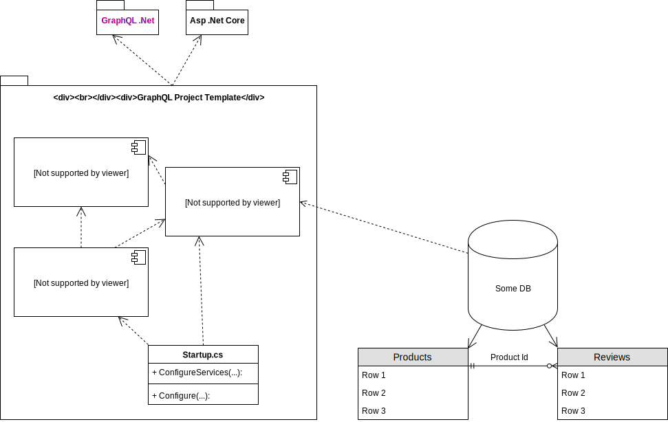

# GraphQL .Net Template
This is a simple [GraphQL](https://graphql.org/) template project written in C#.

## Context
The project exposes a simplified webshop api. There are three types of product ([Book](GraphQl/Types/BookType.cs), [Film](GraphQl/Types/FilmType.cs), [Shoe](GraphQl/Types/ShoeType.cs)) which share [common data](GraphQl/Types/ProductInterface.cs), but also have distinct data fields.
Users have the ability commit reviews to each product. Further, if a user is interested in a product and would like to be notified when a new review is added, he or she can subscribe to new reviews being added.

## Why GraphQL?
Currently (2019) many new apis are realised using RESTful service. Before REST the dominant technology was SOAP, which still accounts for many existing web services. GraphQL was published as an open specification in 2016 by Facebook and has since gained considerable adoption in the community and is generally liked by many developers for its user friendly design.

Hence, exploring GraphQL seemed a good idea as it is a promising piece of technology.

## Architecture Overview
The template project is a C# .Net Core application built with [graphql-dotnet](https://github.com/graphql-dotnet/graphql-dotnet).


The highlighted **GraphQL** component contains almost all logic related to GraphQl. As everything is stitched together in the [Startup.cs](Startup.cs) file, that is listed explicitly as well.

The Products and Reviews are modelled as separate tables in some db, where the reviews have a foreign key to the corresponding product in the products table.

With this architecture it is possible to demonstrate the most important aspects of an api built using GraphQL.

- **queries**
  - aggregation
  - filtering
  - selecting
  - range limiting (hint to pagination)
- **mutations**
  - add data
  - *not implemented*
    - delete data
    - change data
- **subscriptions**
  - subscription to events

## Installing as Template
This project can be installed as a dotnet template project on your system. In order to do that, navigate into the projects root directory and run
```Shell
dotnet new -i .
```
After the template has been installed, you can create a new project by running
```Shell
dotnet new graphql-webapi
```

## Running
Run the command `dotnet run` in a terminal and then open a browser at the projects ui [playground](https://localhost:5001/ui/playground).

Use that web frontend of the api to explore the (generated) GraphQL schema and documentation. You can also interact with the server through a web interface that comes with intellisense to submit queries and mutation requests. If two browser pages are opened, GraphQLs subscription feature can also be tested.

### Sample Messages
The [playground](https://localhost:5001/ui/playground) ui has built in intellisense, so feel free to use the following examples as a starting point to generate your own messages.

#### Queries
```
{
  product(id: <some id>){
    name
    type
    stock
  }
}
```
->
```json
{
  "data": {
    "product": {
      "name": "The Lord of the Rings",
      "type": "Film",
      "stock": 12
    }
  }
}
```
---
```
{
  products(first: 3) {
    name
    type
    ... on Film {
      director
    }
    ... on Book {
      author
    }
    ... on Shoe {
      size
    }
  }
}
```
-->
```json
{
  "data": {
    "products": [
      {
        "name": "The Lord of the Rings",
        "type": "Book",
        "author": "J. R. R. Tolkien"
      },
      {
        "name": "The Linux Programming Interface",
        "type": "Book",
        "author": "Michael Kerrisk"
      },
      {
        "name": "The Lord of the Rings",
        "type": "Film",
        "director": "Peter Jackson"
      }
    ]
  }
}
```

#### Mutations
```
mutation {
  createReview(
    review: {
      productId: <some id>
      title: "My precious book."
      text: "I really enjoyed the long read!"
    }
  ) {
    title
  }
}
```
-->
```json
{
  "data": {
    "createReview": {
      "title": "My precious book."
    }
  }
}
```

#### Subscriptions
```
subscription{
  reviewAdded{
    productName
    title
  }
}
```
--> On new review added, we get an event similar to:
```json
{
  "data": {
    "reviewAdded": {
      "productName": "The Lord of the Rings",
      "title": "My precious book."
    }
  }
}
```

## Resources
[1] Pluralsight course [Building GraphQL APIs with ASP.NET Core](https://app.pluralsight.com/library/courses/building-graphql-apis-aspdotnet-core/table-of-contents)
